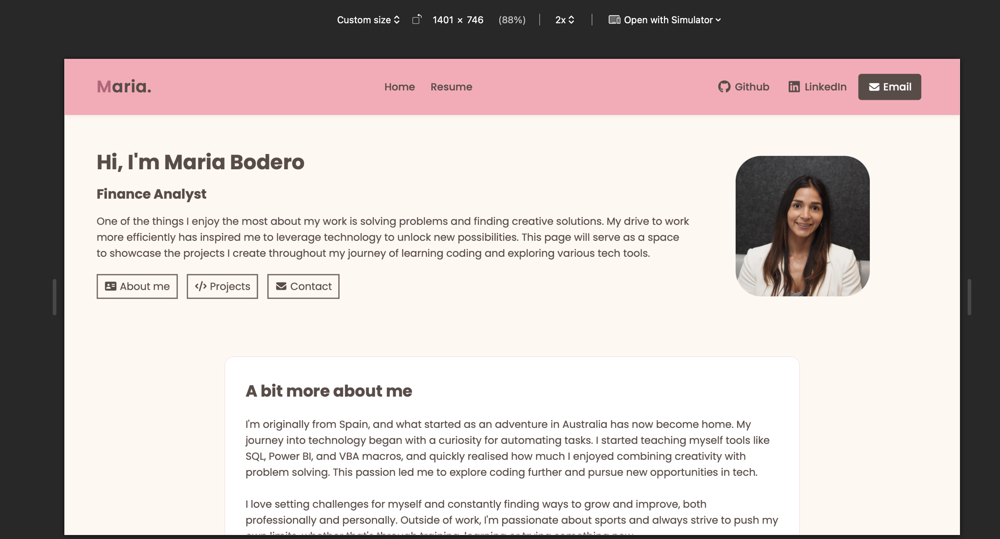
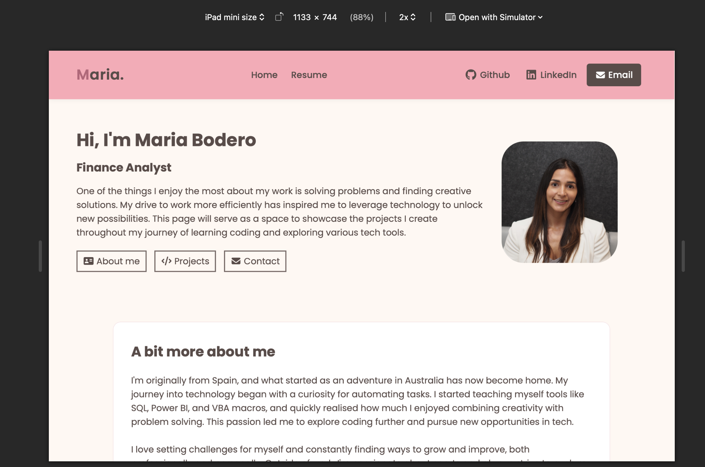

# Maria Bodero – Personal Portfolio

This website was built to share a bit about my background, interests, and what I’ve been learning as I explore coding and technology.  
It’s a simple and clean design made with HTML and CSS, focused on usability and responsive layout.

---

## Live Website
You can view it here: [https://mbodriv.github.io/My_first_website](https://mbodriv.github.io/My_first_website)

---

## About the Website

The site has two main pages:
- **Home:** Includes a short introduction, an “About Me” section, what I’m currently learning, and a contact form.  
- **Resume:** A summary of my professional experience, education, and key skills, plus a link to download my full resume in PDF format.

It’s designed to work smoothly across devices, from desktop to mobile, keeping the same clean structure and soft colour palette.

---

## Technical Details

- Built with **HTML5** and **CSS3**
- Fully **responsive design**
- **Custom colour variables** defined in CSS
- Smooth hover effects on links and buttons
- Icons from **Font Awesome**
- Font: **Poppins** (via Google Fonts)

---

## Screenshots

You can find screenshots in the `screenshots` folder.  
They show how the website looks on desktop, tablet, and mobile screens.

Example:

### Desktop

### Phone 
 

### Tablet 

---

